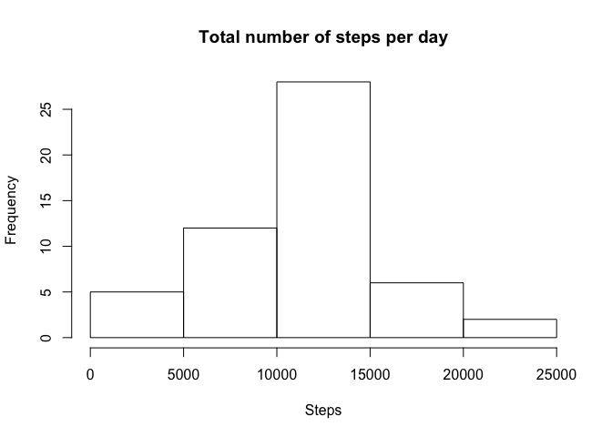
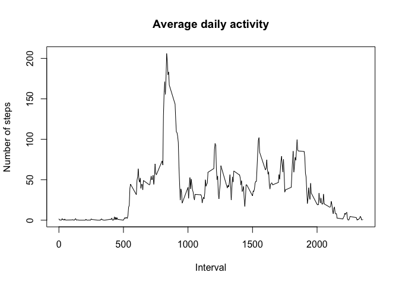
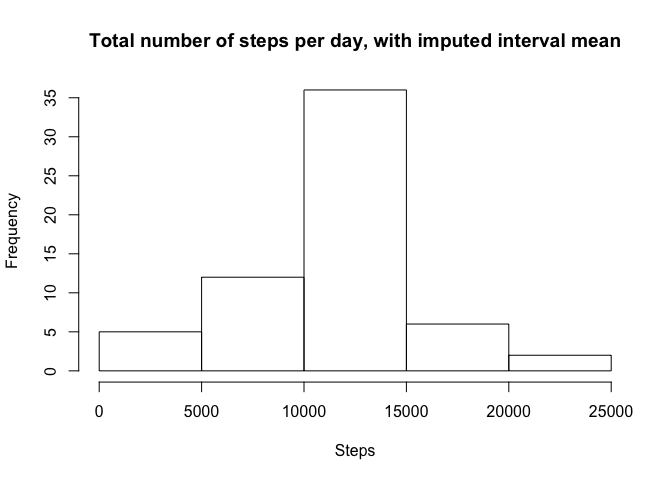
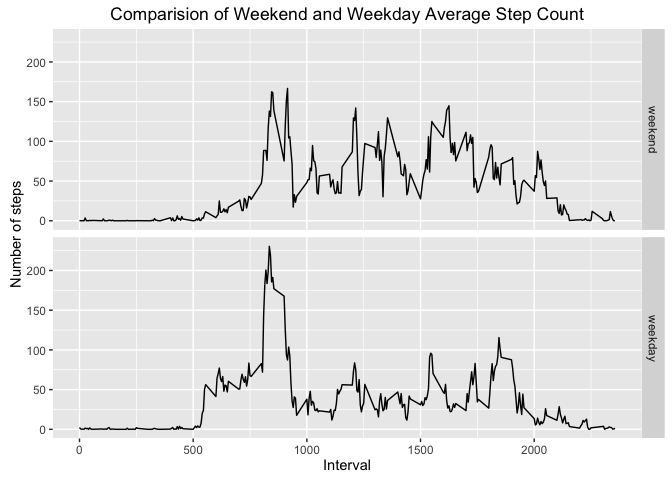

# Reproducible Research: Peer Assessment 1


## Loading and preprocessing the data
Read data from the file activity.zip (provided). 


```r
activity <- read.csv(unz('activity.zip','activity.csv'), stringsAsFactors = FALSE, 
                colClasses = c('integer','Date','integer'))
```

## What is mean total number of steps taken per day?

```r
total_daily <- aggregate(activity$steps, by=list(activity$date), FUN=sum)
hist(total_daily$x, xlab='Steps', main='Total number of steps per day')
```



```r
mean_daily <- mean(total_daily$x, na.rm=TRUE)
median_daily <- median(total_daily$x, na.rm=TRUE)
```
The mean total number of steps taken daily is 10766.19.  
The median total number of steps taken daily is 10765.  

## What is the average daily activity pattern?

```r
a3 <- complete.cases(activity)
avg_int <- aggregate(activity[a3,1], by=list(activity[a3,3]), FUN=mean, na.action=na.omit)
plot(avg_int$Group.1,avg_int$x, type='l', 
     main='Average daily activity',
     xlab='Interval',
     ylab='Number of steps')
```



```r
which.max(avg_int$x)
```

```
## [1] 104
```
Interval 104 (min=835) is the maximum.  

## Imputing missing values

```r
require(dplyr)
```

```
## Loading required package: dplyr
```

```
## 
## Attaching package: 'dplyr'
```

```
## The following objects are masked from 'package:stats':
## 
##     filter, lag
```

```
## The following objects are masked from 'package:base':
## 
##     intersect, setdiff, setequal, union
```

```r
missing_values <- activity  %>% 
  filter(is.na(steps)) %>% 
  count(steps)
```
There are 2304 missing step values.  


```r
# Replace a missing value with the mean for x.
impute_mean <- function(x) replace(x, is.na(x), mean(x, na.rm = TRUE))

# Replace step NA average for the interval.
imputed_activity <- activity %>% 
  group_by(interval) %>% 
  mutate(steps = impute_mean(steps))
```


```r
imputed_daily <- imputed_activity  %>% group_by(date)  %>% summarize(total = sum(steps))
hist(imputed_daily$total, 
     xlab='Steps', 
     main='Total number of steps per day, with imputed interval mean')
```



```r
mean_daily <- mean(imputed_daily$total)
median_daily <- median(imputed_daily$total)
```
The mean total number of steps taken daily is 10766.19 (previously 10766.19)..  
The median total number of steps taken daily is 10766.19 (previously 10765).

#### The impact of imputing data:

* The total number of steps increased.  
* The frequency for the `10000-15000` bin increased by 8.  
* The mean did not change.  
* The median became identical to the mean.   

## Are there differences in activity patterns between weekdays and weekends?

```r
# Add column indiating if the date cooresponds to a weekend or weekday.
activity_daytype <- imputed_activity %>% 
  mutate(daytype = ifelse(weekdays(date) %in% list('Saturday', 'Sunday'), 
                     'weekend', 'weekday')
  ) %>%
  group_by(daytype, interval) %>% 
  summarize(avg = mean(steps))
 
# Reorder levels.
activity_daytype$daytype <- factor(activity_daytype$daytype,
                                   levels = c('weekend', 'weekday'))
 
# Compute number of steps / interval for each day
library(ggplot2)
ggplot(activity_daytype, aes(x=interval, y=avg)) + 
  geom_line() + 
  facet_grid(daytype ~ .)+
  ggtitle('Comparision of Weekend and Weekday Average Step Count') +
  xlab('Interval') +
  ylab('Number of steps')
```



On weekends, the graph shows more activity during the evening hours than on weekdays.   
On weekdays, the graph shows more activity earlier in the day which continues into the afternoon hours. 


